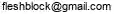

**連絡先**

**自己紹介**

私たちのキリスト集会は東京都町田市で30年活動した。しかし、信徒数は伸びなかった。

- 多くの信徒が離脱し創価学会へと流れた。
- 背景には現世利益（げんせりやく）という問題がある。

キリスト教徒であるには死後の世界を信じ続けなければならない。

画像のムスリムはサラートで「アッラーのほかに神はなし、ムハンマドは神の使徒なり」と祈っている。

- 一日に5回のサラートが義務づけられている。
- 死後の復活と楽園の報償を信じている。

**日本人には霊的世界が理解できない**。「天国は、ほんとうにある」だから天国ポイントを貯めようと口を酸っぱくしても無駄であった。