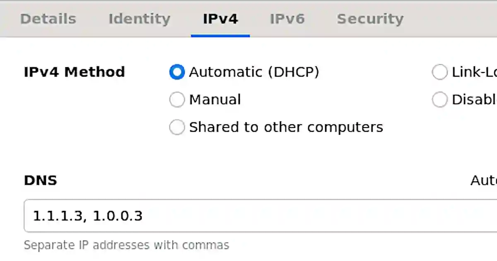
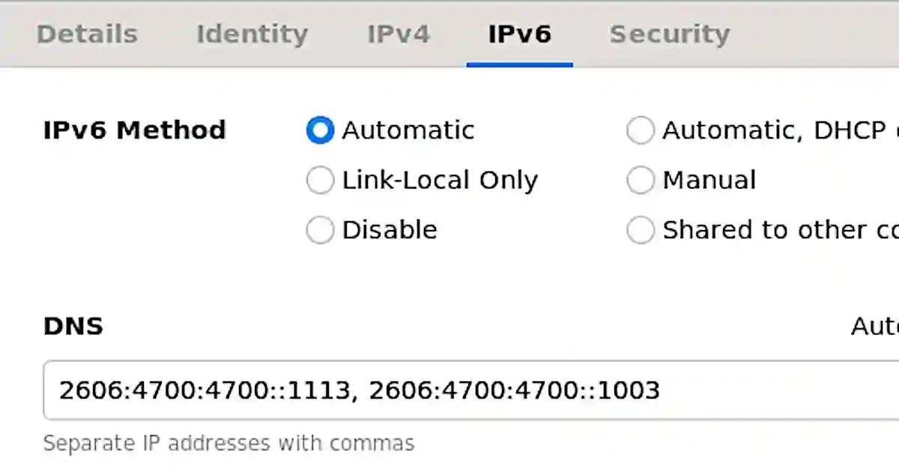
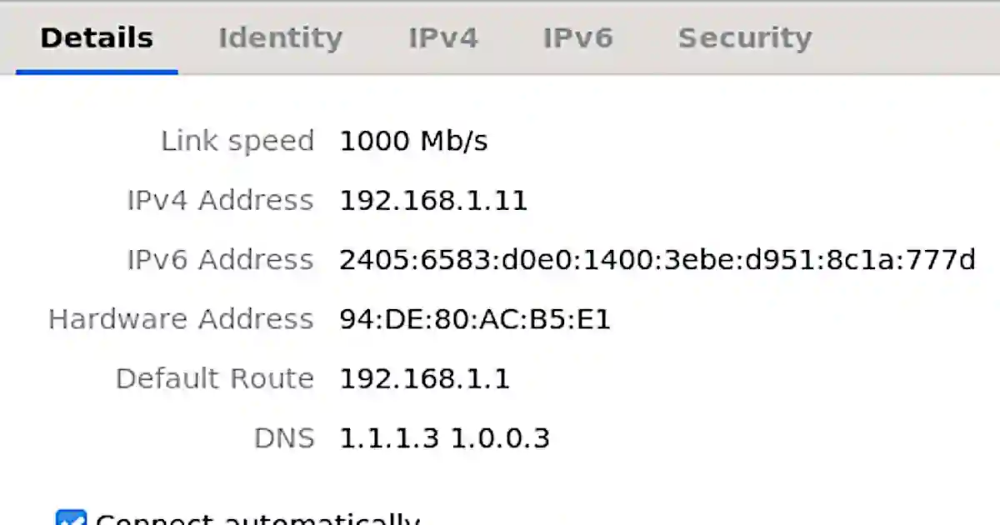

アダルトコンテンツをDNSでブロックすることで、有害なサイトの閲覧を防ぎ子供を守ることができる。<!--more-->

DNSは[1.1.1.1 for Families](https://1.1.1.1/family/)を利用する。

- IPv4
  - 1.1.1.3, 1.0.0.3

- IPv6
    - 2606:4700:4700::1113, 2606:4700:4700::1003

設定後に接続を再起動すると上記のように設定したアドレスが表示される。ブラウザでアダルトサイトにアクセスしても、接続エラーによりアダルトコンテンツを見ることはできない。