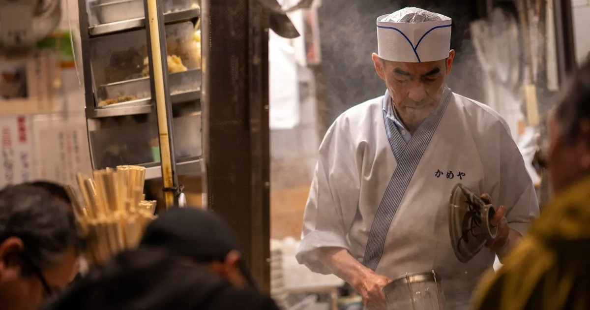

# 中根淳氏のワクチン忌避に疑問の声

欧風食堂グルトン店主の中根淳氏は国民主権党の党員である。<!--more-->

国民主権党は2020年東京都知事選挙において、「コロナはただの風邪」をキャッチフレーズにして選挙戦を繰り広げた。中根氏は感染希望おじさん、または、感染の悦びおじさんと称してYouTubeの国民主権党公式チャンネルで自身の活動を発信した。

> 大変困っています！！  
コロナに感染し、戦い、強い身体になりたいのに、  
僕の周りにコロナ感染者がいません！！  
どなたか、少し分けていただけませんか！！  
マスクをみんながしていたら貰えないのです。  
諦めません！！　感染するまでは！！  
感染する自由があるうちに！！  

[出没！！感染希望おじさん①改め「感染の悦びおじさん」 - YouTube](https://archive.vn/5snE2)

<blockquote class="twitter-tweet">
<a href="https://twitter.com/hashtag/%E3%82%AF%E3%83%A9%E3%82%B9%E3%82%BF%E3%83%BC%E3%83%95%E3%82%A7%E3%82%B9?src=hash&amp;ref_src=twsrc%5Etfw">#クラスターフェス</a> (&#39;A`)……… <a href="https://t.co/mPUgbRw4AB">pic.twitter.com/mPUgbRw4AB</a>
&mdash; kato82@ひとり自粛生活中 (@kato82) <a href="https://twitter.com/kato82/status/1292749187319128065?ref_src=twsrc%5Etfw">August 10, 2020</a></blockquote> 

<blockquote class="twitter-tweet">
こいつらバカだね。「ワクチン反対」と「感染希望」は矛盾している。ワクチンはウイルスに「感染」させて集団免疫をつけるものだ。 <a href="https://t.co/r4eTp4aZCd">https://t.co/r4eTp4aZCd</a>
&mdash; 池田信夫 (@ikedanob) <a href="https://twitter.com/ikedanob/status/1292810384282329089?ref_src=twsrc%5Etfw">August 10, 2020</a></blockquote> 

池田信夫氏が国民主権党を批判している。中根氏はワクチン反対と感染希望の差異を明確にすべきだ。ワクチンを辞書で引くと弱くした、または、死んだ病原体を体内に取り入れるとある。

> a special substance that you take into your body to prevent a disease, and that contains a weakened or dead form of the disease-causing organism

[VACCINE | meaning in the Cambridge English Dictionary](https://archive.vn/PY3jd)

サッカーマムという言葉がある。子供にサッカーを習わせる20代半ばから40代半ばまでの白人、または、アッパーミドル階級の母親だ。彼女たちはワクチンには自閉症のリスクがあると考えており子供への接種を拒否する。中根氏のワクチン忌避も安全性への疑問を含んでいることは明らかである。

ワクチンに対するリスクを高く見積もりすぎたサッカーマムが、子供を殺したジョークもある。

> Vaccine  
> Something soccer moms think give their children autism.  
> Soccer mom - How on earth did my son die from the flu?  
> Average Joe - Did you ever give him a flu Vaccine?  
> Soccer mom - No I did not want to risk autism.  
> Average Joe - That will do it.  

[Urban Dictionary: Vaccine](https://archive.vn/wUp2n)
