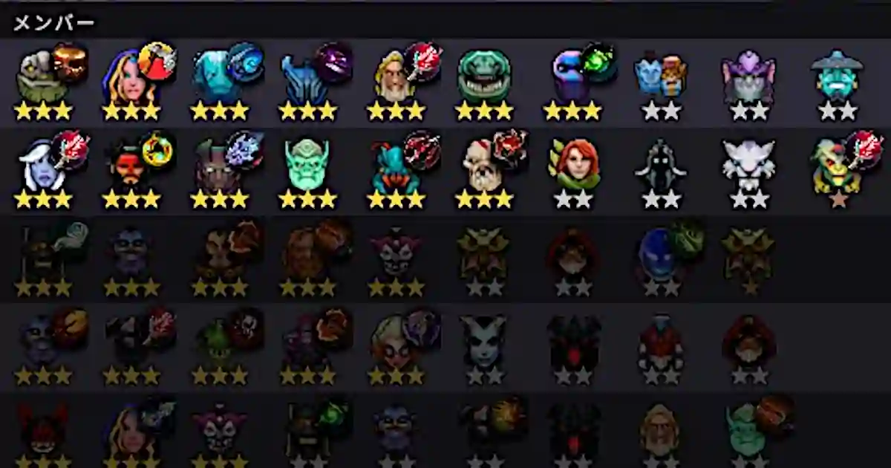
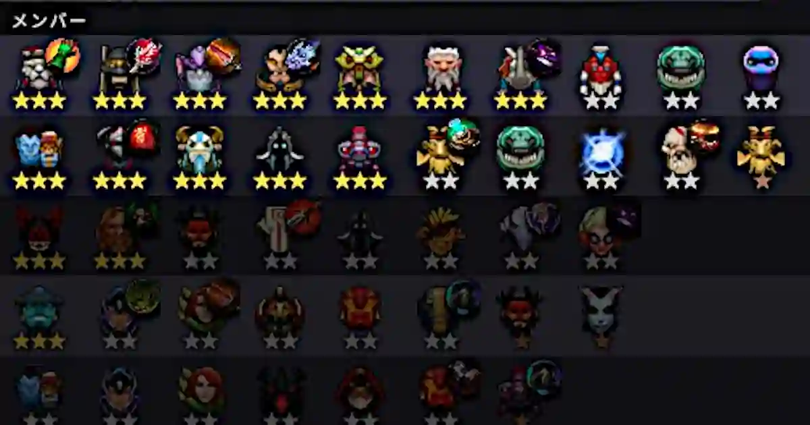

ノックアウトモードで強い構成は柔軟性があることだ。アライアンスの完成に執着してはいけない。<!--more-->

**Mage**

下段の支那人はHHという最強の構成である。EnigmaにRefresher Orbを積むと、AssassinやSpiritのようにポジションが盤面に広く展開することがなければ、どのような構成を相手にしても勝ちが確定している。したがって、サイレンスによってスペルを封じなければならない。支那人がBloodthornを2本積んでいるのはそのためである。

サイレンスに対抗するためにEnigmaを後方に配置するか、または、Lifestealerのような強力なアタッカーからポジションを遠ざけるなどの工夫が必要だ。Enigma頼みであるからMageを揃える意味はない。

**Savage**

下段の支那人はBruteが崩れた形だ。SavageはLycanが肝であるからTidehunterのようなタンクから可能な限り離す。この試合の場合は支那人のChaos Knightに、LycanとMagnusが対峙することになった。

**Spirit**

下段の支那人はHunterだ。Moon Shardを積んだTerrorbladeが強力である。SpiritのDelta Slamでブレイクやサイレンスなどの効果を付与できる。したがって、相手のポジションを密集させることが重要だ。BarricadeとWarriorを横一列に配置し、縦に伸ばさないようにする。Ember SpiritやQueen of Painのスキルにとっても密集させることは効果的である。

**Void**

下段の支那人はSpiritだ。Delta Slamの魔法ダメージを軽減するためにPipe of InsightをNecrophosに積んでいる。ラウンド開始時はBlood-BoundとLycanで勝てる構成ではなかったが、Enigmaを拾ったところ運良くVoid Spiritが出た。Voidは強力でSatanicを積んだSlarkを寄せ付けなかった。DisruptorのStatic StormはBloodthornで封じるとよい。