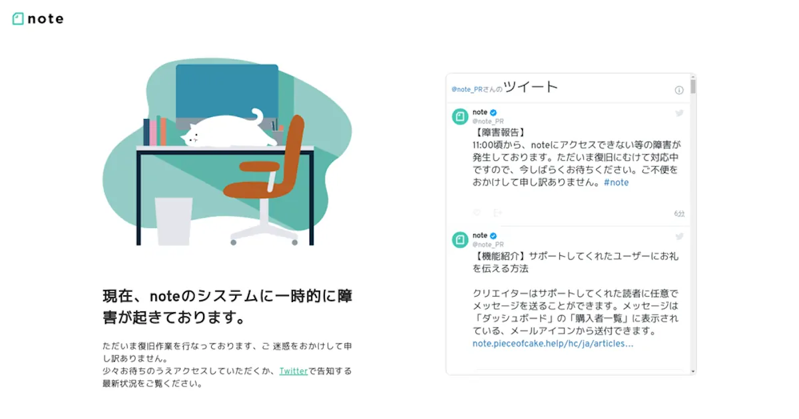
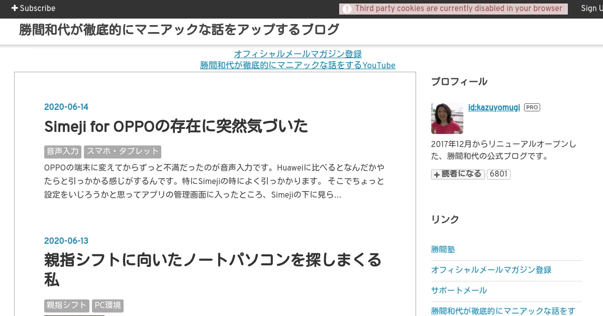

# noteの使い方を覚える前に1秒でやめた理由

noteは独自ドメインを設定することができない。蓄積したコンテンツや他のサイトから集めたリンクは、サービス終了と同時に消える。<!--more-->

> ヤフーが運営するWebサイト作成サービス「Yahoo!ジオシティーズ」が3月31日でサービスを終了した。ネット上では、「貴重なFlashを保管していたサイトが滅びてしまった」「資料が喪失した」など、サービス終了を惜しむ声が上がっている。

[「Yahoo!ジオシティーズ」終了　「貴重な資料消えた」──ネットから惜しむ声 - ITmedia NEWS](https://archive.vn/gH5CR)

Jakob Nielsen氏は、「誰かに名前を所有させることはインターネット上での運命を、その誰かが握っているということであり、サービスの質を好きなだけ低下させることも可能であるから、無料アカウントから離れがたくなる前に、本気でブログを書いていると気がついたならばすぐに離れろ」と[警告](https://www.nngroup.com/articles/weblog-usability-top-ten-mistakes/#articleBody:~:text=10.%20Having%20a%20Domain%20Name%20Owned%20by%20a%20Weblog%20Service)する。

独自ドメインを所有しないということは、領主に生殺与奪の権を握られているのと同義なのだ。

どこでブログを始めるかを検討すると、WordPressということになるだろう。静的サイトジェネレーターはドメインの費用しか支出しないが、ターミナルからコマンドを実行する必要がある。

はてなブログのテーマは10年以上前から進歩がない。勝間和代氏は親指シフトに適した、スペースキーの短い日本語キーボードのノートパソコンを探している。