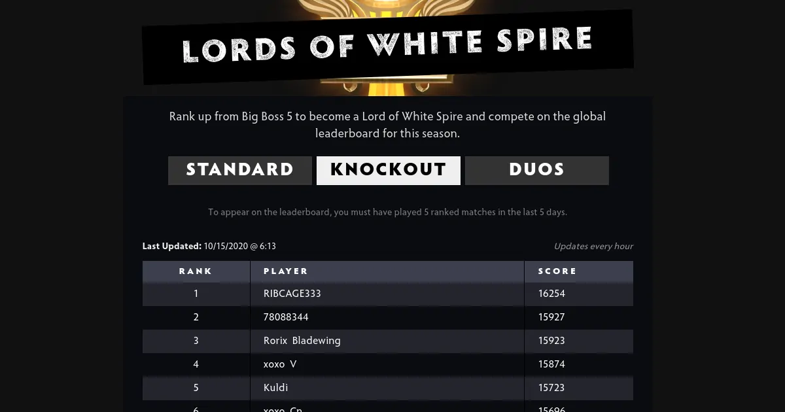

# Dota Underlordsのノックアウトモードを攻略。xoxo V氏の構成

ノックアウトモードでトップ10に入るような高レートのプレイヤーと対戦する機会は少ない。偶然にもxoxo V氏と対戦する機会を得たので構成を中心に紹介する。<!--more-->

xoxo V氏が選択したパックは悪魔とトロールだ。現在のシーズンでトロールに価値はない。したがって、スペクターを取ったという方が正しい。

ラウンド1でカオスナイトが重なった。序盤は重なるだけで有利だ。そして、一時的にナイトとトロールの構成である。ライフスティーラーを組み込んだのは、キャリーが必要だからだ。ノックアウトモードはスタンダードと違いティアー3以下であれば星3になる確率は非常に高い。

ラウンド2でスペクターが重なる。このラウンドで対戦したがメイジではスペクターの火力に歯が立たなかった。

ラウンド3でカオスナイト、テラーブレード、スペクター、ライフスティーラーが星2と万全の状態でラウンド4を迎えてスペクターが星3となる。ノックアウトモードではラウンド3で星3が1体作ることができ、ラウンド4で星3が2体になると良いペースである。この時点で4勝0敗と負けなしであるから余裕を持てる。余裕とはデッキにすぐに使えないヒーローも残すことができる状態のことだ。

ノックアウトモードでは奇数のラウンドごとにアイテムが入手できる。角の冠を2枚重ねてハンターアライアンスを完成させている。3ハンターは30%の確率で2回攻撃することができる。テラーブレードの攻撃力を意識すれば、ハットの存在を忘れることはない。

バットライダーを抜いてアルケミストとアックスを入れ、ハンターと凶暴の構成が完成した。上手いプレイヤーは複数の強い構成に向かって、柔軟で無理のない手組ができる。
