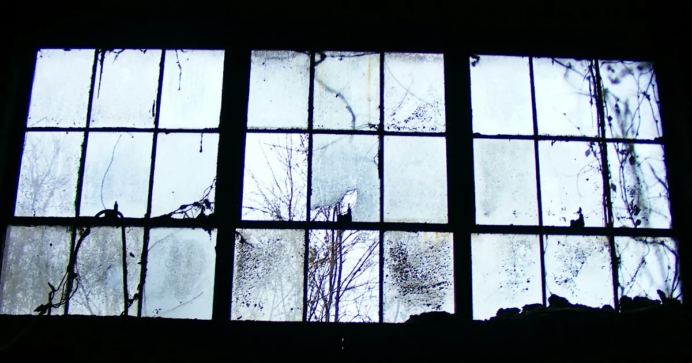

<b>ときどが著した「世界一のプロゲーマーがやっている 努力2.0」が期間限定で無料公開された。私は発売当初から関心を持っていたので飛びついた。読み終えて買わなくて良かったと安どした。</b>

目次だけを見ると興味をかきたてられるのだが実際に読むと肩透かしにあう。間違いなくときどこと谷口一自身が執筆したのだと確信した。プロのライターとの共同作業ではないのだ。このつまらない作文を3万>部も売った編集者は天才だ。

私はミニマリストの本を何冊も読んでいた。だから努力本にある家に置くのはベッドだけという見出しに心が踊った。ベッドだけというのはストイックな方だが落語家の立川こしらはそもそも家がないので上には
上がいる。ときどにはどのようなこだわりがあるのだろうかとマウスをスクロールした。そこには居心地の良い部屋は外に出るのが億劫になるからということしか書いていなかった。これだけである。ベッドだけ
の部屋に住むのがどのようなものなのか想像もつかないが具体的なことは何一つ書いていなかったので今も謎のままである。以上は継続の法則に含まれている話だ。情報があまりにも少なくて法則との接続が見え
ない。

メンタルの法則として自分の通信簿をつけるとある。そこに書いてあるのは本を参考にして通信簿をつけているということだけだ。どのような項目があるのかすら書いていない。私はときどの努力本の宣伝でこの
通信簿の項目が写っている画像を目にした。メンタルに関することが書かれているようではあったが理解できなかった。だから本に詳しく書かれていることを期待していたのだがこれも肩透かしであった。一事が
万事この調子である。

ときどの努力本には具体的な話が出てこない。この本で私が得られたのはときどが空手の師範に深夜にメールをして怒られたということを知れたことだけである。ライターを入れてときどから素材を引き出し具体
例を努力本の6大法則に落とし込むべきであったことは明白だ。以下にプロのライターの原稿の作り方を引用する。

> これは拙著『職業、ブックライター。』でも書いたことだが、実は文章を書く仕事をしながら、書く重要性というのは3割程度だと私は考えている。それ以上に重要なのは、書く素材を見つけてくることだ。私>の場合、そのための方法が、取材をすることであり、インタビューをすること。違う言い方をすれば、取材やインタビューに失敗したら、いい原稿は作れないと考えているのである。

[上阪徹の"ブックライター"式ワークスタイル～外出編～あえて非効率を選ぶ、ということ（上阪 徹） | 現代ビジネス | 講談社（1/4）](https://gendai.ismedia.jp/articles/-/37862)

総じてつまらない奴には特徴がある。それは本音を言わないことだ。人間は本音を吐けば誰でもおもしろくなる。年齢を重ねて取り繕うことだけがうまくなるのは寂しいものだ。
