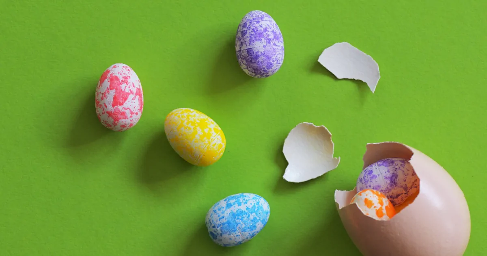

<b>ときどの新刊『世界一のプロゲーマーがやっている 努力2.0』が期間限定で無料公開された。</b>
  
読み終えて買わなくて良かったと安どした。まるでイースターエッグだ。殻に「世界一」と「東大卒」が派手に描かれているだけである。

このつまらない作文を3万部も売った編集者は天才だ。目次だけを見ると興味をかきたてられるのだが実際に読むと肩透かしにあう。間違いなくときどこと谷口一が執筆したのだと確信した。プロのライターとの共同作業ではない。  

継続の法則にある家に置くのはベッドだけという見出しに心が踊った。ミニマリストの考え方は気になる。読むと居心地の良い部屋は外に出るのが億劫になるとしか書いていなかった。情報があまりにも少なくて法則との接続がよく分からない。

メンタルの法則として自分の通信簿をつけるとある。本を参考にして通信簿をつけているという。どのような項目があるのかは書いていない。

努力本には具体的な話が少ない。あるとすれば深夜に空手の師範へメールをして怒られたということくらいだ。ライターを入れてときどから素材を引き出せていればこうはならなかった。

> これは拙著『職業、ブックライター。』でも書いたことだが、実は文章を書く仕事をしながら、書く重要性というのは3割程度だと私は考えている。それ以上に重要なのは、書く素材を見つけてくることだ。私の場合、そのための方法が、取材をすることであり、インタビューをすること。違う言い方をすれば、取材やインタビューに失敗したら、いい原稿は作れないと考えているのである。

[上阪徹の"ブックライター"式ワークスタイル～外出編～あえて非効率を選ぶ、ということ（上阪 徹） | 現代ビジネス | 講談社（1/4）](https://gendai.ismedia.jp/articles/-/37862)

ときどの体験を原稿に落とせていない。だから何をどのように努力しているのか伝わってこない。世界一のプロゲーマーの本は読んでもためにならない。
