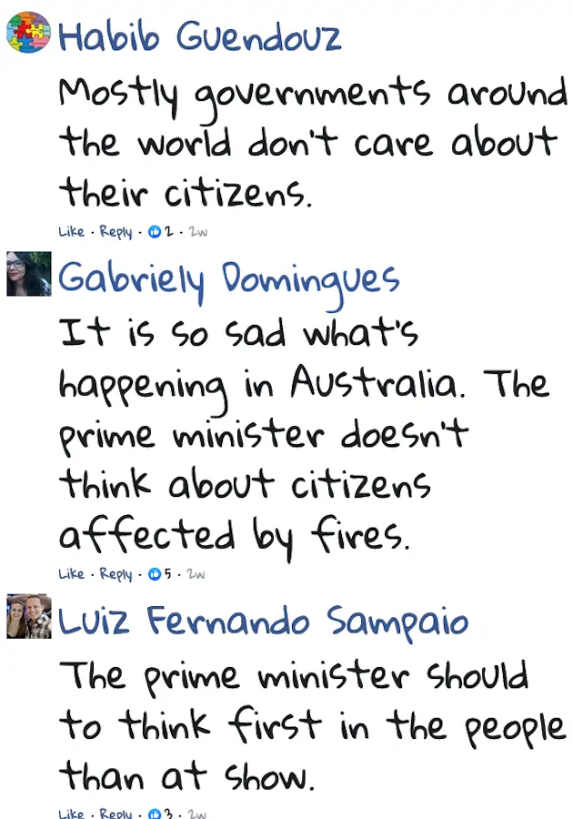

<b>オーストラリアにも自粛ムードがある。同調圧力を利用して過剰な自粛を求める人々も目につく。</b>

> Hundreds of thousands of people signed a petition to cancel Sydney’s New Year’s Eve fireworks show. 
> They want to use the $4.5 million for the show to help firefighters or the people affected by the fires. The Australian Prime Minister said that he will not cancel the show.

[Australia’s Fires – level 3 | News in Levels](https://www.newsinlevels.com/products/australias-fires-level-3/)

オーストラリアのビクトリア州で大勢の人々が火事による影響で避難を余儀なくされた。新年にシドニーで行われる花火大会の中止を求めて数十万人が署名をした。新年を祝うための予算を消防士や火事による避難者へ振り向けろという。首相は花火大会を中止するつもりはない。

個人であれば勝手に自粛していればよいが集団でとなると問題だ。同調圧力が働いてこれまで気に留めていなかった人々が自粛ムードに巻き込まれる。道徳を振りかざす人々は自分が正しいと信じている。

一番目は政府は市民を気にかけていないという極論だ。二番目は火事に巻き込まれた人々のことを考えていないと首相を非難している。三番目は首相は花火の前に避難者のことを考えるべきという一般論だ。

物事を分け隔てて考えることのできない人々がいる。個人であればマルチタスクは嫌われるが政府は違う。花火を中止すべき義務はない。AをしているときにBをしてはならないなどという法律もない。

同調圧力は身勝手で感情的な人間が作り出す。雰囲気に流されずに物事を公平に判断するのが政府の努めだ。その点からも中止を拒否した首相の決断は正しい。
